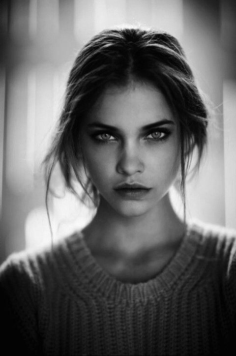
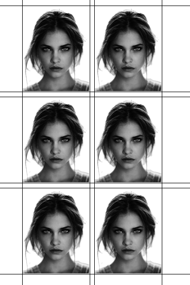
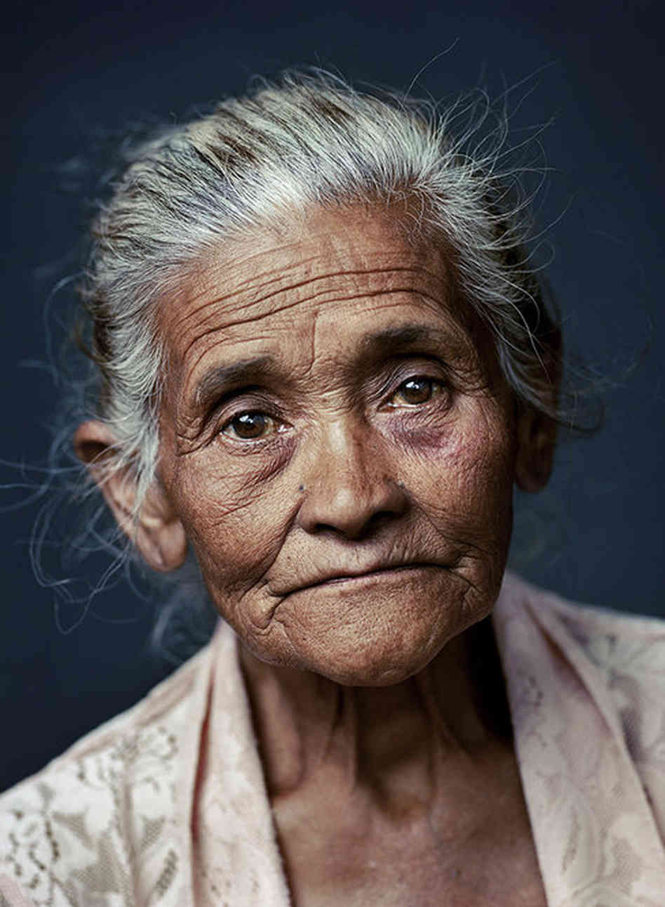
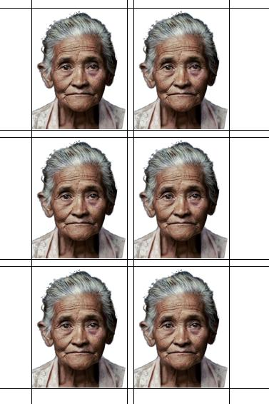

# What is this?

I am not a US citizen, therefore I need a VISA to any country I am going :) As a result, I need a lot of photos for VISAs, new passports (because of stamps), and I don't like the photos I get at photo centers. The worst photo is on the passport, you should know this.

Therefore, I spent a few days writing this program that utilizes the power of machine learning algorithms to create nice photos for documents: passports, visas, and other certificates you need.

# What it does?

- Loads photo
- Removes background
- Detects face and then aligns it, see demos, it works really well.
- Crops photo to the document photo size, 35x45mm, size can be adjusted.
- Prepares a 100x150mm photo sheet that you can print for 30 cents at any print center.

# Under the hood
-  [face_recogniton](https://github.com/ageitgey/face_recognition): Built using dlib’s state-of-the-art face recognition built with deep learning. The model has an accuracy of 99.38% on the Labeled Faces in the Wild benchmark.
- [carvekit](https://github.com/OPHoperHPO/image-background-remove-tool): image segmentation using tracer_7b pretrained model, bacground removal

# Demo

I used images from this dataset https://www.kaggle.com/datasets/ashwingupta3012/male-and-female-faces-dataset








# Usage
```
    pipenv install
    pipenv run ./main.py <origin photo file> <result photo file>
```

